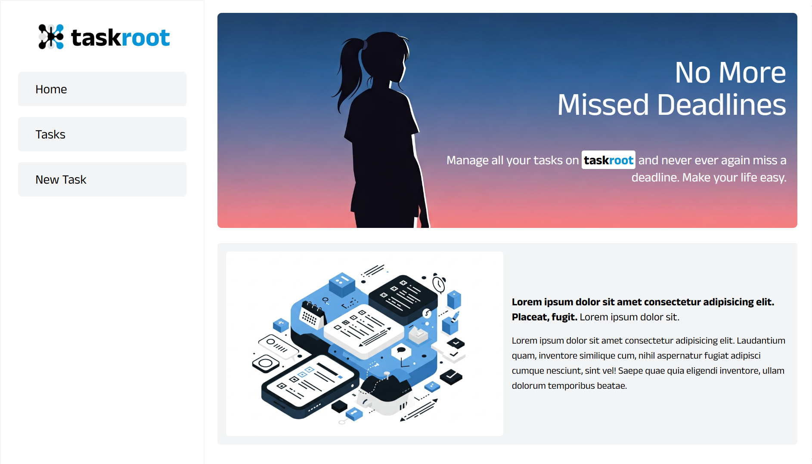
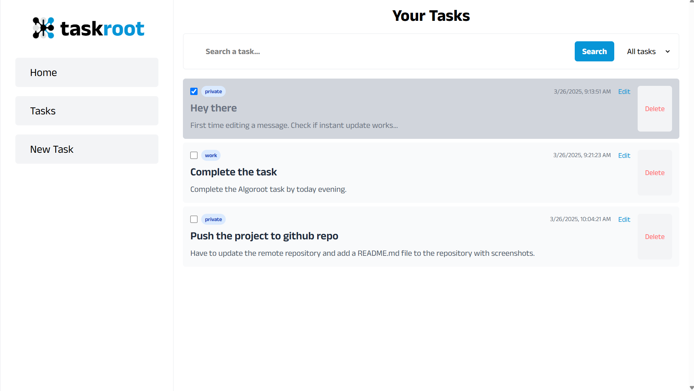
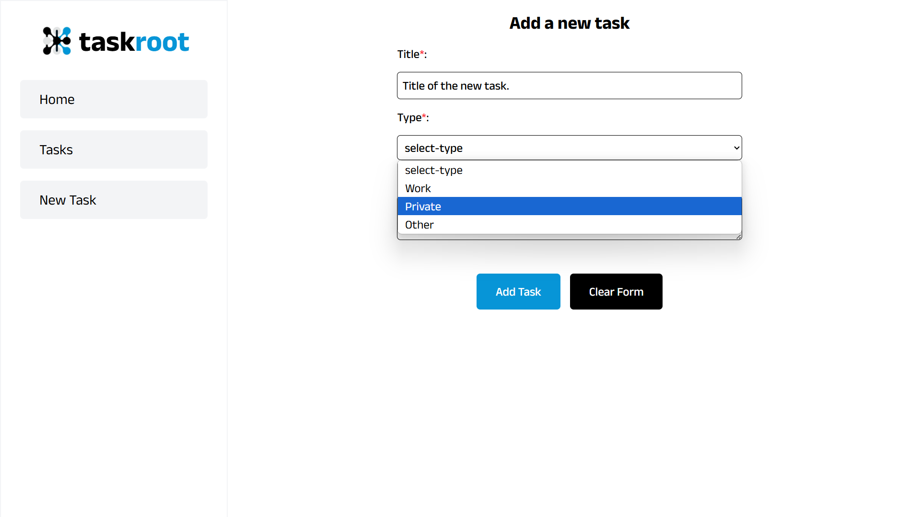

# TaskRoot - Task Management Application

A full-stack task management application built with React, Node.js, and MongoDB. TaskRoot helps you organize and manage your tasks efficiently with features like task creation, status updates, filtering, and more.

## UI Screenshots

### Home Page View


### List of All Tasks


### Task Creation Form


## Features

- Create, read, update, and delete tasks
- Mark tasks as complete/incomplete
- Filter tasks by type (Work, Private, Others)
- Edit task details
- Responsive and modern UI
- Real-time status updates

## Tech Stack

- Frontend: React, TailwindCSS, Axios
- Backend: Node.js, Express
- Database: MongoDB
- Development Tools: Vite, Postman

## Installation

### Prerequisites

- Node.js (v14 or higher)
- MongoDB
- npm or yarn

### Backend Setup

1. Navigate to the backend directory:
```bash
cd backend
```

2. Install dependencies:
```bash
npm install
```

3. Create a `.env` file in the backend directory with the following content:
```env
MONGO_URL=your_mongodb_connection_url
PORT=4000
```

4. Start the backend server:
```bash
npm start
```
for hot reloading
```bash
nodemon index.js
```

### Frontend Setup

1. Navigate to the frontend directory:
```bash
cd frontend
```

2. Install dependencies:
```bash
npm install
```

3. Create a `.env` file in the frontend directory with the following content:
```env
VITE_API_URL=http://localhost:4000
```

4. Start the frontend development server:
```bash
npm run dev
```

## API Documentation

### Base URL
```
http://localhost:4000
```

### Endpoints

#### 1. Get All Tasks
- **Method**: GET
- **Endpoint**: `/tasks`
- **Response**:
```json
[
  {
    "id": "string",
    "title": "string",
    "description": "string",
    "type": "string",
    "isCompleted": boolean,
    "datetime": "ISO date string"
  }
]
```

#### 2. Create Task
- **Method**: POST
- **Endpoint**: `/tasks`
- **Request Body**:
```json
{
  "title": "string",
  "description": "string",
  "type": "string",
  "isCompleted": boolean,
  "datetime": "ISO date string"
}
```
- **Response**:
```json
{
  "message": "Successfully added new task."
}
```

#### 3. Get Single Task
- **Method**: GET
- **Endpoint**: `/tasks/:id`
- **Response**:
```json
{
  "id": "string",
  "title": "string",
  "description": "string",
  "type": "string",
  "isCompleted": boolean,
  "datetime": "ISO date string"
}
```

#### 4. Update Task
- **Method**: PUT
- **Endpoint**: `/tasks/:id`
- **Request Body**:
```json
{
  "title": "string",
  "description": "string"
}
```
- **Response**: Updated task object

#### 5. Update Task Status
- **Method**: PATCH
- **Endpoint**: `/tasks/:id/status`
- **Response**: Updated task object with toggled status

#### 6. Delete Task
- **Method**: DELETE
- **Endpoint**: `/tasks/:id`
- **Response**:
```json
{
  "message": "Task deleted successfully"
}
```

## Testing the API

### Using Postman

1. Import the following collection into Postman:
```json
{
  "info": {
    "name": "TaskRoot API",
    "schema": "https://schema.getpostman.com/json/collection/v2.1.0/collection.json"
  },
  "item": [
    {
      "name": "Get All Tasks",
      "request": {
        "method": "GET",
        "url": "http://localhost:4000/tasks"
      }
    },
    {
      "name": "Create Task",
      "request": {
        "method": "POST",
        "url": "http://localhost:4000/tasks",
        "body": {
          "mode": "raw",
          "raw": "{\"title\":\"Test Task\",\"description\":\"Test Description\",\"type\":\"work\",\"isCompleted\":false,\"datetime\":\"2024-03-20T12:00:00Z\"}",
          "options": {
            "raw": {
              "language": "json"
            }
          }
        }
      }
    }
  ]
}
```

### Using cURL

1. Get All Tasks:
```bash
curl http://localhost:4000/tasks
```

2. Create Task:
```bash
curl -X POST http://localhost:4000/tasks \
  -H "Content-Type: application/json" \
  -d '{"title":"Test Task","description":"Test Description","type":"work","isCompleted":false,"datetime":"2024-03-20T12:00:00Z"}'
```

3. Update Task Status:
```bash
curl -X PATCH http://localhost:4000/tasks/{task_id}/status
```

4. Delete Task:
```bash
curl -X DELETE http://localhost:4000/tasks/{task_id}
```

## Contributing

1. Fork the repository
2. Create your feature branch (`git checkout -b feature/AmazingFeature`)
3. Commit your changes (`git commit -m 'Add some AmazingFeature'`)
4. Push to the branch (`git push origin feature/AmazingFeature`)
5. Open a Pull Request
